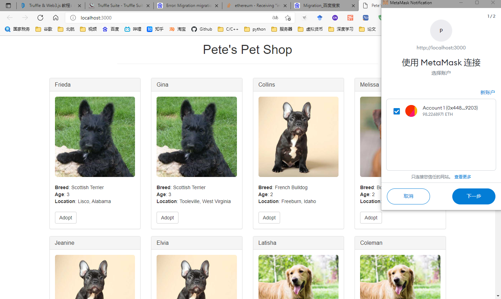

# truffle-pet-shop
truffle的官方例程，代码已经添加好。

之前参考<https://trufflesuite.com/tutorial/index.html>的中文教程，但是里面有一些错误，修改起来麻烦。

后面直接参加官方例程<https://trufflesuite.com/tutorial/index.html>，一步一步来。就是现在的repositoty。

####使用之前，需要
1.安装[Ganache](https://trufflesuite.com/ganache/)，启动

2.在浏览器里安装MetaMask，导入Ganache的密钥

####下载之后：
```
npm install
```
```
truffle compile
```
```
truffle  migrate
```
```
truffle test
```
####最后，运行
```
 npm run dev
 ```
 浏览器会自动弹开，进入这个页面。


 
 #### 记录一下使用过程可能会出现的错误：

 1. npm install没有权限，或者安装完之后找不到安装的包
 https://blog.csdn.net/weixin_46794385/article/details/119847646

 2. Truffle Unbox failed问题解决方法
 https://blog.csdn.net/weixin_45591812/article/details/116800865

 3. 合约版本错误
 https://blog.csdn.net/sinyusin/article/details/88558519

